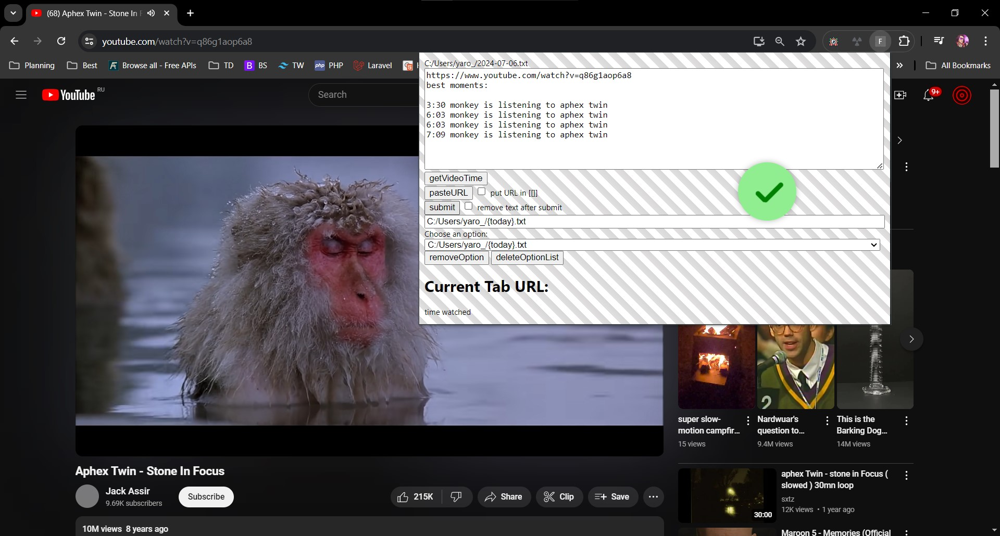
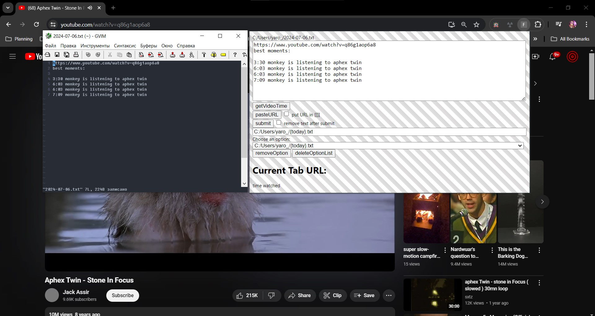
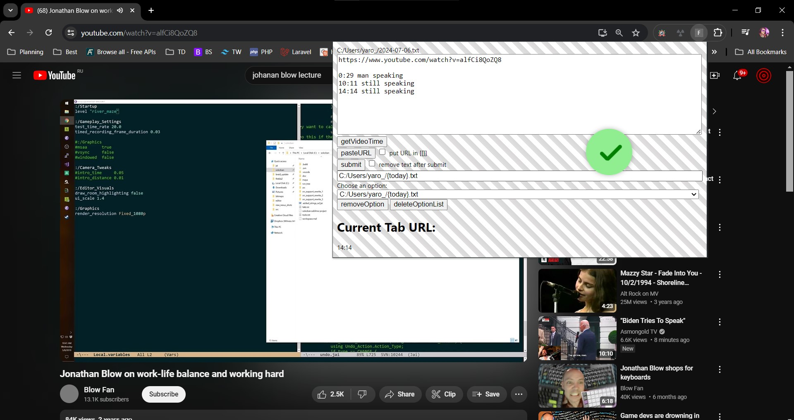
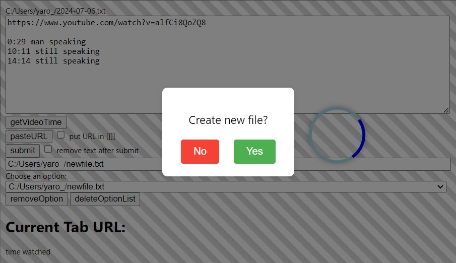

# chrome-extension

To enable this extension:
1. change ping.reg file, so last line points to ping.json file
2. execute ping.reg file and check result (on windows in regedit)
3. set up chrome extension in chrome browser and set id of extension in ping.json allowed origins 
like this: "chrome-extension://'extension ID'/"

Nice features:
1. keywords {today} and {hostname}:
usage:
C:/Users/yaro_/{today}.txt => C:/Users/yaro_/2024-07-06.txt
C:/Users/yaro_/{hostname}.txt => C:/Users/yaro_/www.youtube.com.txt
2. Create file if does not exist dialog box
3. Video timestamps (if does not work, try to reload chrome)
4. obsidian auto brackets checkbox

